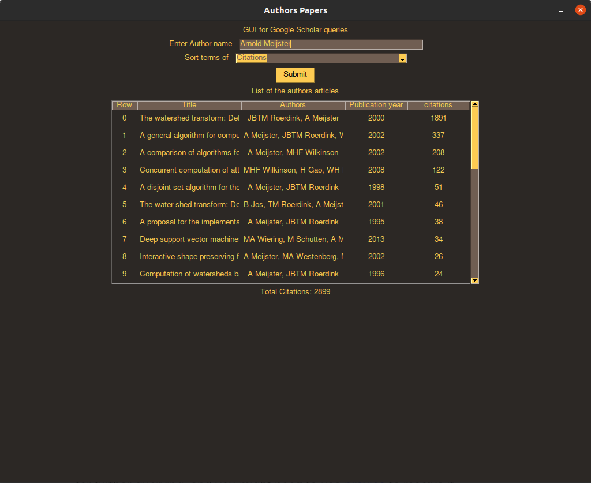
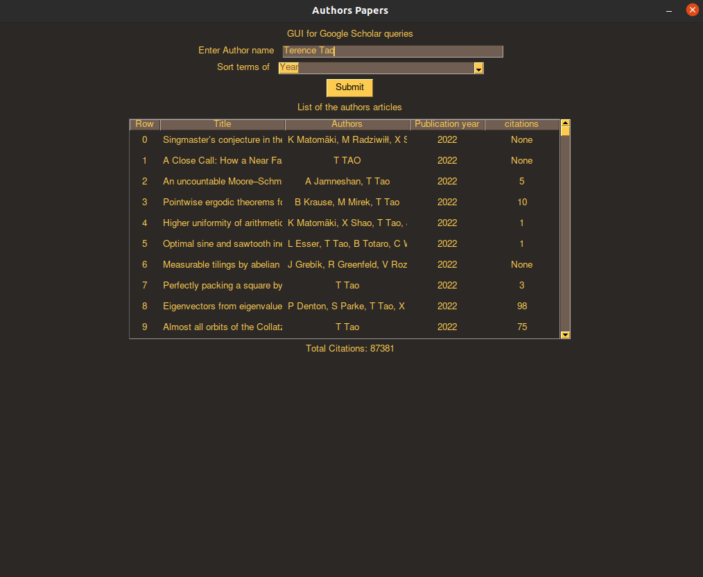
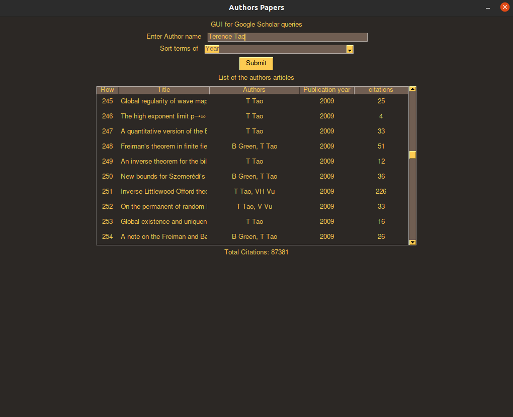

# First part of the Information Retriveal Assignment

## How to use the application

1. Run `python3 part1.py` and enter an author name and how you would like to sort his/her publications
2. After a few seconds the data will be loaded in the table

## Documentation

The project has been built using python3: version 3.8.0, SERP API,scholarly and a couple of more python modules

1. User Interface
    - Implemented using PySimpleGUI: Users are able to enter an author name and sort either on publication year or by the number
    of citations of the papers.
    
2. Api calls
    - Calling a SERP API endpoint to get papers of author and then iterating over if we still have more papers
    this is due to the fact that only 100 are maximum returned per query and for example when searching for Terence Tao
    there are over 500 results.

3. After API call
    - We update te view in the GUI bby taking the table and placing the new data inside it.
    

## Screenshots of input and output

## Some things we noticed
1. We are happy to report that we believe our program is faster than average
from what we found generally using serp api is much faster than scholarly, especially for more detailed information
he only place serp is not good enough is for the second part. This is why we had to switch from our original approach or using
Spring Boot,Angular and Docker-Compose to python because we could not perform those demanding queries only with serp and the small
free limit they have.
