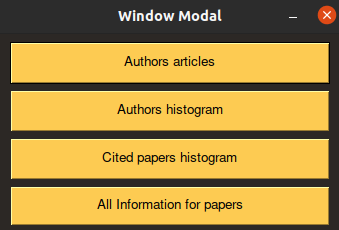
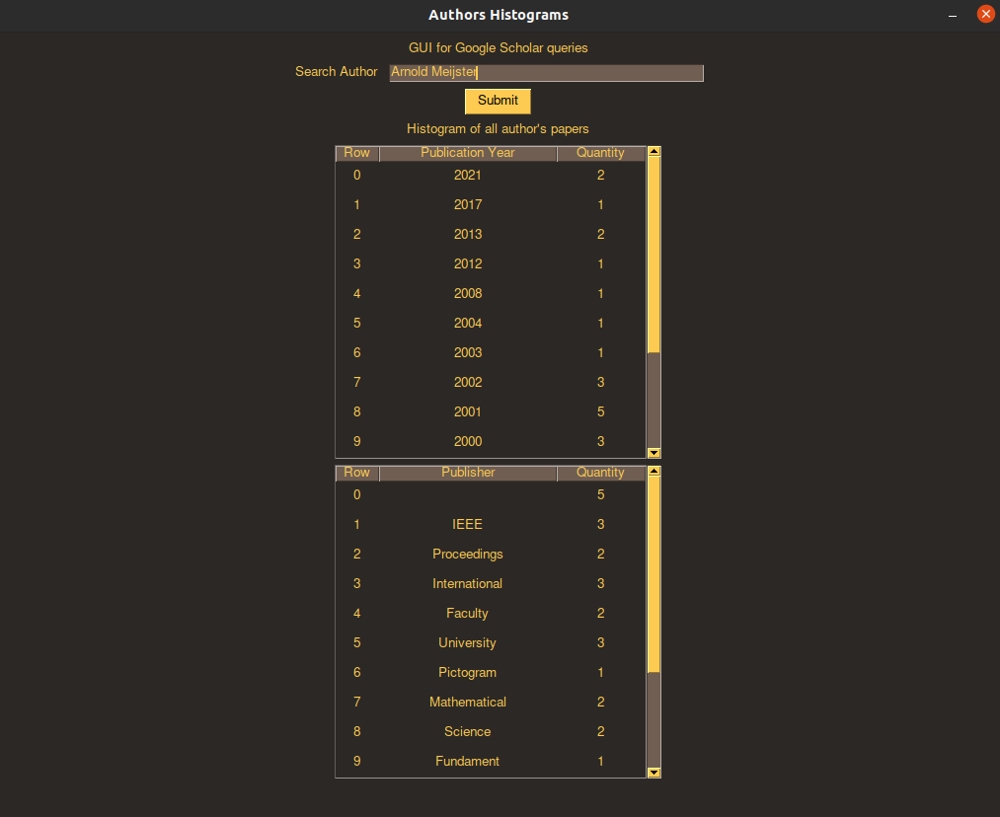
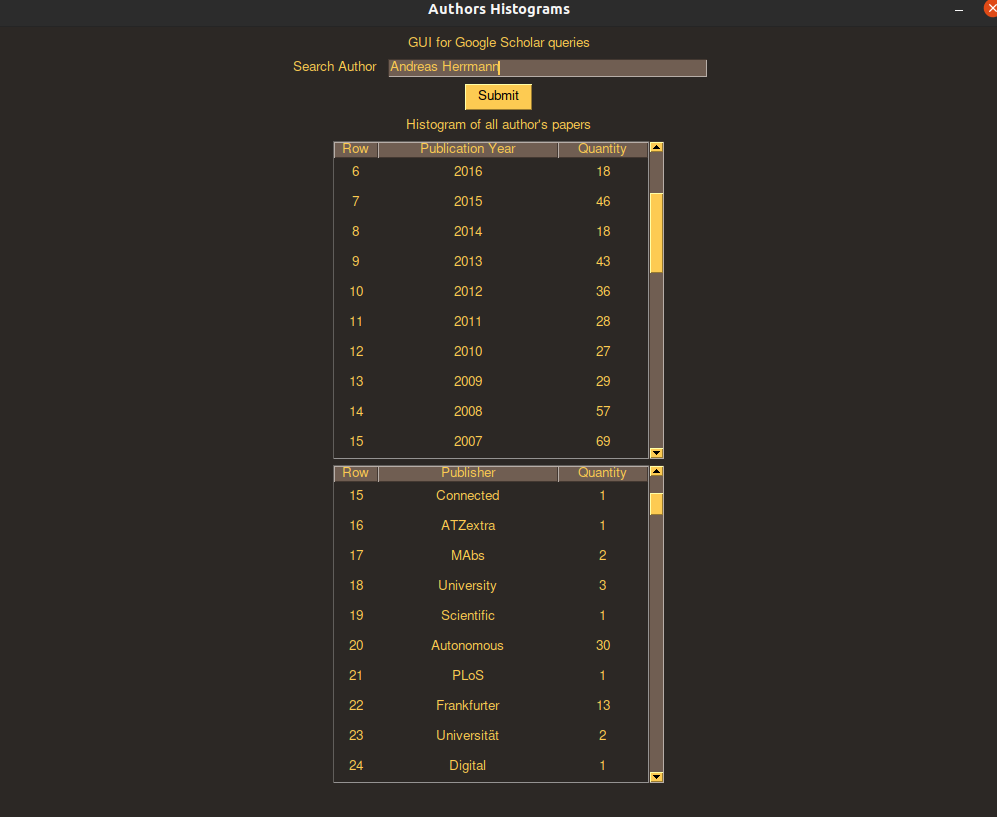
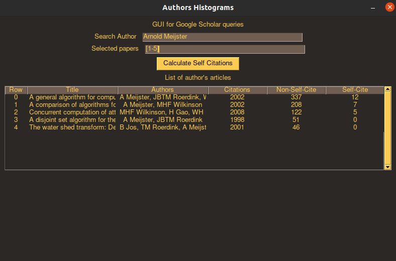
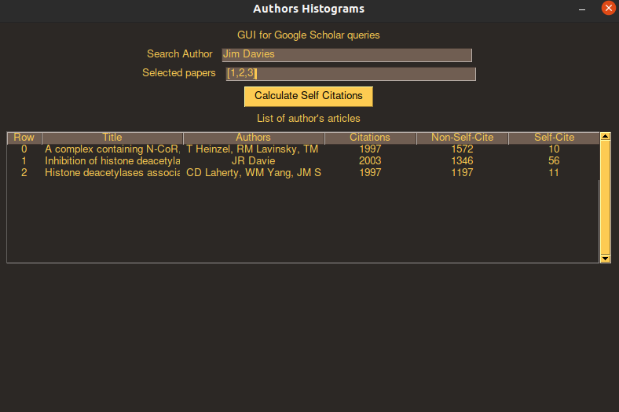

# Information Retrieval Second Assignment

## How to use the application
1. Run `python3 part2.py` you will then see the following:
    - Window modal: This window acts as a gateway for the rest of the assignment. Each button
    will lead to new window which is part of the assignment and there the GUI will guide you on how to use the specific fields.
    
## Why did we chose this approach
2. Having one window to act as a gateway seemed very natural because people might want to jump back and forth between
view. This also enables the user to perform one query in one window look adn the results and based on them perform
another query in a different window.

## Documentation

1. Histograms for the authors papers
    - This part was relatively straightforward we used SERP API to retrieve all of the authors papers and the api also provides
    us very conviniently with a graph/table which acts as a histogram for what we need. From there we just needed to take the data
    from the proper fields and display it in the table of the page.
    
2. Hostigrams for the papers citing the selected papers
This part had multiple components to it. First, we had to make a design choice on how to interpret the strings
"[1,2,3]" or "[1-10]" in order to extract those papers. Second we need to make a more complex query this time using Scholarly python module.
    - Selected papers: We went with a more programatic approach, not with a regex. Although it involved a bit more code it is very suitable for this case
    bacause of the functionality that python provides.
    - After getting the papers we needed to make the following sequence of queries:
        * Get all papers of an author
        * Extract only the needed ones
        * Query using citedby to get the information needed
        * Store the information in a matrix like way for the tables to use
        * Return the data
    - After doing all of that it was just a matter of updating the tables in the view with the data returned from the methods.
    
### What we noticed
Due to the fact that the citedby query may potentially be executed thousands of times this operation could take quite a while,
couple this with he fact that we have to use a proxy in order not to get banned and that scholarly is much slower that serp. All of these
factors compound immensly and the overall latency in my opinion is very bad.

3. Calculating self citations
    - We reused the method for getting the selected papers
    - Got the papers
    - Got extra information about each paper
    - Compared authors
    - Based on if there was a match we calculated self-citations
    
## Screenshots of input and output

    
    
    
### Some problems we encountered along the way
1. Having to use proxy, major drawback, slows down everything overall not a pleasent experience.
2. Getting the publishers was a bit tricky had to use a python module for parsing url and still sometimes it had edge cases
3. The combination of having to use both SERP and schoarly. Due to the assignment and how it was structured overall Scholarly was a THE ONLY CHOICE
if you want to finish the assignment. I would say this limits a lot the creativity. The assignment could be made much moe profesionaly if we could solve it using
only serp api because this would allow for us to use different frameworks like: React,Angular,Etc and involve more diversity in the solutions.
4. Sometimes shcolarly and serp produced different output so it wa hard to trust scholarly and if possible would always refer serp, however serp allows for only
100 unique queries per month.
