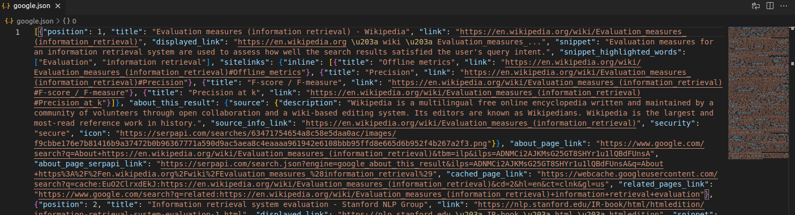

# Information Retrieval Assignment 4 documentation

## Part 1 Retrieval of web-search results

### Approach to the problem

We decided on the following implementation. The user will pass in their engine preference, the query and the top_n
results they wish to see. Keep in mind that the top_n results are the top_n organic results. We believe that this made the most sense.
In order to obtain those results we have created an auxiliary function called `get_results_for_engine` this function will take the params that
SERP_API expects to query this engine. Then we will start querying untill we get n results. This makes our code so that no matter how many results we want we can handle it by using the efficient pagination that SERP_API provides out of the box. We appned hte organic results found in each search
to a list and then return it. After we have retrievd the results for all the 4 engines we want we save them into a json file. In that we we will cache
the results and we do not need to query SERP_API later. We will perform all of our statistical measures from now on based on the cached results.

### Each part of our code has been documented for easy of use. The functions that we needed for the first part are as stated

1. `get results_from_engine(params,top_n)` To obtain results for specific engine (auxiliary function)
2. `get_search_results(algo,query,top_n=2)` Function to obtain results for any of the 4 engines (Google,Yahoo,Bing, and DuckDuckGo)
3. `save_results_to_file(result,filename)` Function to cache the results into a json file for later use

### Some screenshot sof the files we have obtained just to show proof of concept

## Part 2 Retrieval Evaluation

### Precision and Recall

We had to find the precision and recall of each of the four search engines compared to the baseline (Google). Some importnatn notes on how we approached the problem. Each of the non-baseline engines has a file with 20 top_n links. The baseline engine (Google) has 10 top_n links which the other will be compared against. We created a function called `precision_recall(retrieved_docs,relevant_docs)`. This function accepts as first argument the set of retrieved documents (the engine we are evaluating), and the relevant documents(the engine we are comparing against in our case Google). This function then evaluates for each document the precision and the recal. Screenshot will be provided. When we find a document from the retirved docs in the relevant docs we attach to it the current recall value and the precision. If the document is not found then we just attach (None,None).

We can clearly see that Bing and DuckDuckGo have the exact same evaluation, Yahoo has nearly the same one however it is slightly less accurate than the other 2. Inconclusion we can say that the 3 non-baseline engine perform roughly the same (on the given query)

### Precision at 11 standard recall levels

This data structure allowed us to then easily graph the precision at the standard 11 recall values. In order to be able to plot them however we had to implement an auxiliary function `get_next_recall(curr_recall,precision_recall)`. This function exists because we follow the formula `P(r_j) = max P(r), r_j <= r`. This allows us to have accurate values when plotting the precisions at the standard 11 recall levels. Screenshots can be seen bellow.

1. 
2. 
3. 
4. 

### Single valued summaries

Finally, we had to implement single valued summaries for the engines. We needed to compue the P @ 5, P @ 10 and the F - Measure. We decided that a good
approach to show these metrics is through tables. SO we have create a table for the P @ 5, P@ 10 and one for the F-Measure. Below you can see the tables tha indicate the score at each rank (We assume it will be easier for the people to look at a table).

1. 
2. 
3. 
4. 
