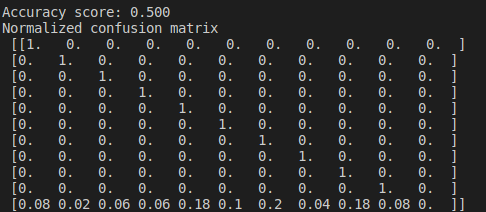
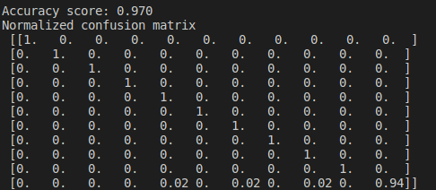
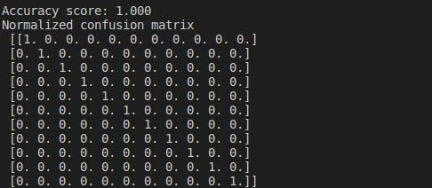
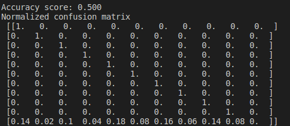
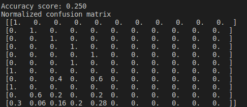

# Information Retrieval Lab 6

## Results

1. Case 1
   - Number of known people: 10
   - Number of images per person: 10
   - Threshhold: 1.0
   - 

We can observe that we have guessed correctly half of the test set. This (as we will see after we observe the other results)
can be contributed to the fact that we have a high threshhold value. Thus it is more likely to find similarity between faces and
not get rejected, thus associate with a wrong person and not with unknow person. If the value of the threshhold is lower
we will reject more people thus we will have higher accuracy score. As far as the confusion matrix gets, we can observe that there are only
a few cases where the error is pretty high (e.g above 0.1), but there is error in all of the samples. As said above this should
guide us that a) we either need more trainig data or b) we need to configure the threshold value better.

2. Case 2
   - Number of known people: 10
   - Number of images per person: 10
   - Threshold: 0.5
   - 

We can see that now our model performs much better. Due to the lower threshold value we can see that the chances of rejecting a person are
higher nad thus our models manages to reject unknown faces. Wehnwe halfed the threshold we increased our accuracy by nearly 2 times. From the confusion matrix we can see our results have drastically changed only having very minor errors in columns 4,6,8,10.

3. Case 3
   - Number of known people: 10
   - Number of images per person: 10
   - Threshold: 0.44
   - 

When we lower slightly bit more the threshold we can observe perfect results. With this parameters we fine tuned our model to have 100% accuracy.

4. Case 4
   - Number of known people: 10
   - Number of images per person: 5
   - Threshold: 1.00
   - 

Although we use half the ammount of pictures to train our model we still observe the same results as if we used 10 with these parameters.
Thus again suggest the importance of the threshold value. Infering that from the pictures our model is well trained however because the
value for rejection is so high we have accuracy score of only 0.5. The confusion matrix is distributed differently. This can also lead us
that potentially even if we tweak the threshold value we would not observe as higih of an accuracy score as we wanted, suggesting that just
the we lack training in the model itself.

5. Case 5
   - Number of known people: 5
   - Number of images per person: 5
   - Threshold: 1.0
   - 

As expected we only get 0.250 accuracy score. This is expetcted because we have halved every paramter and we are testing on the full dataset.
essentially this is the base case but we only have 5 know people so it is normal that when we test it on the full data set we will have
at best half of the accuracy.

## Structure of the code and some assumptions

The code itself is very straighforward we compute the feature vector for the test images in the same manner
as for the training ones. We then just put them in the cosine function to compare them and then calculate to which
picture they have the samnllest distance. Important assumption we make about the groundtruth and predictions arrays is that we will
fill them with the folder numbers. I.e our labels are the number of the folders we assume in each folder there is only one person
and we assume that in training folder 00 and test folder 00 we have the same person. Otherwise our labeling would not work.
